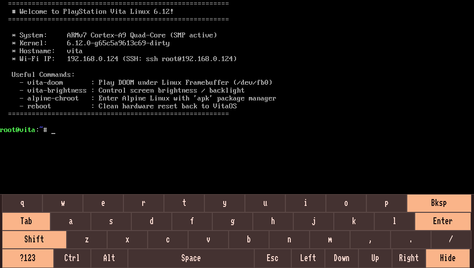

# LinuxOnVita - Complete Handheld Linux Distribution for PS Vita

[](https://en.wikipedia.org/wiki/PlayStation_Vita)
[](https://kernel.org)
[-green.svg)](https://developer.arm.com/Processors/Cortex-A9)
[](https://discord.gg/BrzdmHu8Am)
[](LICENSE)

A complete distribution, automated build environment, and handheld userland for running **Linux 6.12** on hacked PlayStation Vita consoles ([HENlo](https://vita.hacks.guide/using-henlo) / HENkaku / Ensō 3.60 & 3.65).

While original proof-of-concept projects proved that modern Linux can boot on the PS Vita SoC, they required specialized developer equipment such as soldered UART serial cables. LinuxOnVita bridges the gap into a **fully standalone, interactive handheld Linux device** with out-of-the-box touch typing, physical gamepad navigation, automated on-device Wi-Fi, memory-safe ZRAM swap, full package management (`apk`), and native framebuffer gaming.

<p align="center">
  
</p>

---

## 📚 Complete User Guide

> [!TIP]
> **Looking for the comprehensive user manual?**
> Check out the **[Complete User Guide](USER_GUIDE.md)** for detailed walkthroughs on every built-in utility (`vita-wifi`, `vita-brightness`, `vita-swap`, `vita-doom`), on-screen touch typing, physical gamepad controls, remote SSH access, and real-world software you can install with Alpine Linux (from Python file servers to native C compilers).

---

## ✨ Features

- **Built-in Touch Keyboard (`fbkeyboard`):** Type directly on the console screen with an on-framebuffer virtual keyboard featuring dual ABC / ?123 layouts, special keys, and a hide toggle.
- **Physical Gamepad Navigation (`vita-input-mapper`):** Complete console shell navigation using the D-Pad, face buttons, and shoulder triggers synthesized through `/dev/uinput`.
- **Fixed Controller Logic:** Corrected inverted button mask issues and initialized analog sticks via Syscon for smooth twin-stick controls in games and terminal navigation.
- **Full Display Brightness:** Patched baremetal bootloaders to initialize displays at 100% brightness on both OLED and LCD models, plus runtime backlight adjustment on PS Vita 2000 via `vita-brightness`.
- **Interactive On-Device Wi-Fi Manager (`vita-wifi`):** Scan, connect, and switch wireless networks directly on the console with an ASCII signal table. Saves credentials permanently to your memory card without needing to edit config files on a PC.
- **Fast Boot & OpenSSH:** Boots straight into the Linux terminal. Wi-Fi connects automatically with OpenSSH and mDNS (`vita.local`), ready in ~12 seconds.
- **Alpine Linux Chroot (`alpine-chroot`):** Run an isolated, persistent Alpine Linux userland on storage with full `apk add` package management.
- **Compressed ZRAM & Memory Safety (`vita-swap`):** Zero-latency LZ4 compressed RAM swap expands usable memory from 512MB to ~768MB-1GB, preventing Out-Of-Memory (OOM) crashes during heavy package installs, Python scripts, or C compilation. Includes physical SD card swapfile auto-mounting.
- **Storage Auto-Mounting:** Automatically detects and mounts SD2Vita (`/mnt/ux0`), internal memory (`/mnt/ur0`), and secondary storage (`/mnt/uma0`) on boot.
- **Framebuffer DOOM (`vita-doom`):** Pre-installed pure-C `fbdoom` engine with twin-stick controls, analog deadzones, and input isolation.
- **All-in-One Installer App (`LinuxOnVita.vpk`):** Graphical bootstrapper with real-time partition detection, memory card mount selector, and 1-click on-device installer.
- **Automated Docker Build:** Build the entire stack (kernel, rootfs, loaders, and VPK) with a single command (`./build.sh all`).

---

## 📦 Quick Installation

### Prerequisites
1. **Custom Firmware:** Any PS Vita (1000 OLED, 2000 Slim, or PlayStation TV) running **3.60 or 3.65** with HENkaku / Ensō (see [vita.hacks.guide](https://vita.hacks.guide)).
2. **Enable Unsafe Homebrew (Critical):**
   - Open **Settings** -> **HENkaku Settings** -> check **Enable Unsafe Homebrew [✓]**. If unchecked, the loader plugin will fail with error `0x8002D003`.
3. **Official Sony Memory Card Strictly Required:**
   - The baremetal loader interfaces directly with Sony's proprietary memory card hardware (MSIF). It cannot boot from SD2Vita game-card adapters or internal eMMC (`imc0:`).
   - *SD2Vita Users:* Your SD2Vita adapter mounts as `ux0:`, and your official Sony card is typically `xmc0:` or `uma0:`. The LinuxOnVita app automatically detects your Sony card and installs boot files directly to it.

### Installation Steps
1. Download **`LinuxOnVita.vpk`** from the [GitHub Releases page](https://github.com/devwithzachary/LinuxOnVita/releases).
2. Transfer `LinuxOnVita.vpk` to your PS Vita using VitaShell (USB or FTP).
3. In VitaShell, highlight `LinuxOnVita.vpk` and press **CROSS (✕)** to install.
4. Launch **LinuxOnVita** from the LiveArea.
5. Select your Sony Memory Card partition (e.g. `xmc0:` for SD2Vita users, or `ux0:` for standard consoles) and press **CROSS (✕)** to install the bundled Linux files.
6. Press **CROSS (✕)** to boot straight into Linux!

For full usage instructions, gamepad shortcuts, and Wi-Fi setup, see the **[Complete User Guide](USER_GUIDE.md)**.

---

## 🛠 Hardware Support Matrix

| Hardware Component | Status | Implementation Details |
| :--- | :--- | :--- |
| **CPU** | **Working** | Quad-core ARM Cortex-A9 MPCore (SMP active across all 4 cores) |
| **Display / Framebuffer** | **Working** | 960x544 OLED (Vita 1000) and LCD (Vita 2000) at 100% full brightness |
| **Backlight Control** | **Working (LCD)** | Dynamic PWM control via I2C bus 1 on PS Vita 2000; OLED fixed at 100% Level 15 Gamma |
| **Wi-Fi (Marvell SD8787)** | **Working** | `mwifiex_sdio` on SDIF2 with custom Ernie power sequencing and on-device `vita-wifi` |
| **Touchscreen** | **Working** | `vita-syscon-ts.c` multi-touch digitizer mapped via `evdev` for `fbkeyboard` |
| **Buttons & D-Pad** | **Working** | Patched `vita-buttons.c` driver with uniform active-low mask and `/dev/uinput` mapping |
| **Analog Sticks** | **Working** | Syscon `0x180` analog sampling enabled with deadzone filtering |
| **Storage (eMMC / ur0)** | **Working** | Auto-detected SCE partitions (`/dev/mmcblk0p1`-`p12`), `ur0` mounted at `/mnt/ur0` |
| **Storage (SD2Vita / ux0)** | **Working** | Powered via Syscon `0x888`, auto-mounted at `/mnt/ux0` (`/dev/mmcblk1p1`) |
| **Memory Expansion (ZRAM)** | **Working** | 256MB compressed LZ4 RAM swap pool with `vita-swap` management |
| **Storage (Sony Memory Card)** | **Loader Only** | Boot files loaded via baremetal MSIF driver; Linux MSIF runtime driver not yet implemented |
| **UART0 Serial Console** | **Working** | 115200 baud serial debug console |
| **Battery Fuel Gauge** | **Not yet supported** | Isolated on Syscon (Ernie) private I2C bus; runtime streaming unsupported |
| **Bluetooth** | **Not yet supported** | Marvell SD8787 Bluetooth driver not enabled in kernel config |
| **Audio** | **Not yet supported** | Vita audio codec lacks an active Linux ALSA driver |
| **3D GPU Acceleration** | **Not supported** | PowerVR SGX543MP4+ lacks open-source Linux drivers (software rendering via simplefb) |

---

## 🔨 Building from Source (Docker)

You can build the entire distribution (RootFS, Linux 6.12 Kernel, baremetal loaders, and the VPK) using Docker:

### 1. Clone the Repository
```bash
git clone https://github.com/devwithzachary/LinuxOnVita.git
cd LinuxOnVita
```

### 2. Run the Automated Build System
```bash
# Build the Docker build environment container (one-time setup)
./build.sh image

# Build everything: RootFS, Kernel, Loaders, and LinuxOnVita.vpk
./build.sh all

# (Optional) Package a complete release archive
./build.sh release
```
All compiled outputs are saved to `output/`:
* `output/LinuxOnVita.vpk`: The all-in-one bootstrapper and installer.
* `output/ux0/linux/`: Standalone boot files (`zImage`, `vita1000.dtb`, `vita2000.dtb`, `payload.bin`, `baremetal-loader.skprx`).
* `output/LinuxOnVita-release-<version>.zip`: Distributable all-in-one release archive.

---

## ❓ Common Troubleshooting

* **Error `0x8002D003` when launching LinuxOnVita:**
  Unsafe Homebrew is disabled. On your Vita, go to **Settings** -> **HENkaku Settings** -> check **Enable Unsafe Homebrew**.
* **"Memory card not inserted" on boot:**
  An official Sony memory card is strictly required on all consoles (both 1000 and 2000 models). The baremetal bootloader only speaks to Sony MSIF hardware and cannot read from internal eMMC or SD2Vita adapters.
* **Frozen on `Uncompressing Linux... done, booting the kernel`:**
  The Device Tree blob does not match your hardware. In LinuxOnVita, reinstall boot files or ensure `vita1000.dtb` (OLED) or `vita2000.dtb` (LCD) is copied to your memory card's `linux/vita.dtb`.

For additional help and step-by-step guidance, see the **[Complete User Guide](USER_GUIDE.md)**.

---

## 👏 Credits & Upstream Sources

This project builds upon the groundbreaking research and development of the PS Vita homebrew and Linux reverse-engineering community:

- **[incognitojam](https://github.com/incognitojam)**:
  - [vita-linux-port](https://github.com/incognitojam/vita-linux-port) - Modern Linux 6.12 port, Marvell Wi-Fi custom power sequencing (`pwrseq_vita_wlan.c`), High-Res timer fix, SCE eMMC partition driver, and Buildroot integration.
  - [linux_vita (6.12)](https://github.com/incognitojam/linux_vita) - Modernized Linux 6.12 kernel tree for PS Vita.
- **[xerpi (Sergi Granell)](https://github.com/xerpi)**:
  - Original Linux on PS Vita pioneer: [linux_vita](https://github.com/xerpi/linux_vita), [vita-baremetal-loader](https://github.com/xerpi/vita-baremetal-loader), [vita-libbaremetal](https://github.com/xerpi/vita-libbaremetal).
- **[DvaMishkiLapa](https://github.com/DvaMishkiLapa)**:
  - [vita_plugin_linux_loader](https://github.com/DvaMishkiLapa/vita_plugin_linux_loader) - Bootstrapper VPK with partition file verification.
- **[Team Molecule & taiHEN](https://github.com/henkaku)** - HENkaku jailbreak and taiHEN kernel framework.
- **[VitaSDK](https://vitasdk.org/)** - Open-source PlayStation Vita software development kit.
- **[Bootlin](https://toolchains.bootlin.com/)** - Precompiled ARMv7 cross-compilation toolchains.

---

## 🤝 Community, Contributing & AI Policy

Have questions, need help troubleshooting, or want to share photos and clips of Linux running on your Vita? Join our **[Discord Community](https://discord.gg/BrzdmHu8Am)**!

Contributions, bug reports, and feature requests are welcome! Feel free to join the discussion on Discord, check out the [issues page](https://github.com/devwithzachary/LinuxOnVita/issues), or submit a pull request.

Please review our **[AI Usage Policy](AI.md)** for guidelines on using AI coding assistants when contributing to this project. All code submitted must be thoroughly reviewed and personally owned by the human author; automated bot PRs are not accepted.

---

## ☕ Support the Project

If LinuxOnVita has been useful to you, consider supporting continued development:

<div align="center">
  <a href="https://www.patreon.com/DevWithZachary"></a>
  &nbsp;
  <a href="https://buymeacoffee.com/linuxonandroid"></a>
</div>

---

## 📄 License

LinuxOnVita is licensed under the [GNU General Public License v3.0](LICENSE) (GPL-3.0).
Upstream source trees (Linux kernel, Buildroot, VitaSDK) retain their respective licenses (GPLv2, MIT, BSD).
